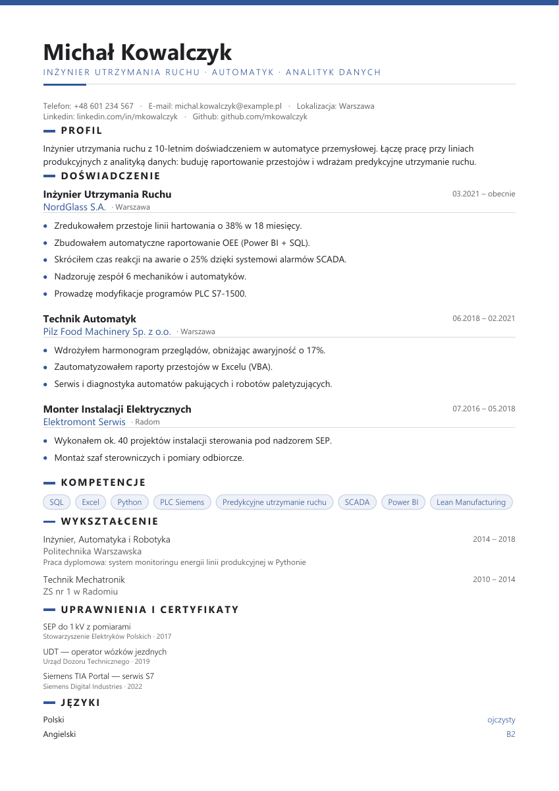

# Audyt krytycznych ryzyk funkcjonalnych

Audyt jest prowadzony na podstawie kodu, testów syntetycznych i widoku
przeglądarki. `Działa` oznacza wyłącznie sprawdzony zakres; `Częściowo` oznacza,
że brakuje dowodu z pełnej ścieżki użytkownika; `Do sprawdzenia` nie jest oceną
negatywną. Nie używamy rzeczywistych CV. Zmian kodu nie wdrażano na
produkcję; konfigurację logowania Entra/Supabase zmieniono w działającej usłudze.

## Problemy i rozwiązania już zastosowane

Tabela odróżnia poprawkę w kodzie od konfiguracji działającej usługi. Żaden
wiersz nie oznacza zamknięcia całego audytu: otwarte ograniczenia są opisane
niżej i muszą przejść osobną weryfikację przed zmianą statusu na „Działa”.

| Problem | Zastosowane rozwiązanie | Dowód i granica potwierdzenia |
| --- | --- | --- |
| Wynik ATS udawał szansę przejścia; szybki i pełny raport się rozjeżdżały | Jeden kanoniczny wynik 0–100 i neutralne etykiety; obowiązkowe i opcjonalne kryteria liczone osobno | Testy kanonu i lokalny przejazd szybkiego wyniku; produkcja nadal pokazuje starszy tekst marketingowy do czasu wdrożenia kodu |
| Wymagania z ogłoszenia mieszały tytuł, firmę, atuty i formalne kwalifikacje | Parser usuwa rozpoznany nagłówek, zachowuje `TCP/IP`, oddziela atuty; matcher wymaga potwierdzenia konkretnej kategorii uprawnienia | Testy parsera/holdout i syntetyczny ekran desktop + 375 px; nie ma kalibracji na zewnętrznych ATS |
| Generator potrafił dopisać niepodane fakty lub powtórzyć edukację | Podsumowanie i klauzula zgody tylko na podstawie przekazanej treści; deduplikacja edukacji i wspólne źródło danych do eksportu | Testy generowania oraz lokalny podgląd; artefakt produkcyjny nadal wymaga porównania z podglądem |
| PDF przenosił ukryty Vault i nie drukował części jawnych uprawnień | Usunięto ukryte dane i zmyślone poziomy; widoczny renderer uprawnień, opisu i osiągnięć | Testy Python i Node na syntetycznych danych; bez porównania z pobranym PDF produkcyjnym |
| Operacje AI mogły ruszyć bez świadomej zgody na przekazanie danych | Serwerowe bramki zgody oraz prawdziwe komunikaty o zakresie wysyłki do Azure | Testy tras; rzeczywisty przepływ Azure + Supabase nie został jeszcze domknięty |
| Zapis lub usuwanie profilu mogły utracić dane albo odtworzyć je po usunięciu | Trwały transfer do IndexedDB, blokada późnego autosave i oczekiwanie na usunięcie obu magazynów | Testy transakcji i pełny ekranowy test usunięcia fikcyjnego profilu; usunięcie konta w Supabase nadal bez testu |
| Logowanie Microsoft było widoczne, lecz dostawca nie był skonfigurowany | Rejestracja Entra, callback Supabase, `xms_edov`, zakres `email`, włączony dostawca i `kierivo.com` jako Site URL | Rzeczywiste logowanie kontem właściciela i odświeżenie sesji przeszły; lokalny kod z zakresem `email` nie jest jeszcze na produkcji, a wydawca nie jest zweryfikowany |
| Bank STAR kopiował do CV fikcyjne metryki, narzędzia i uprawnienia | Przyciski „Kopiuj” i „Wstaw” przekazują szablon z polami do uzupełnienia; widok oznacza zdania jako fikcyjne przykłady | Test funkcji szablonu i kontrola typów przechodzą; pełny ekranowy test wstawienia i eksportu pozostaje do wykonania |

## Inwentarz wejść głównych

Konfiguracja `NAV_SECTIONS` i pasek boczny pokazują **10 wejść na poziomie
głównych funkcji**: Start, Profil, Sprawdź dopasowanie, Trenuj, Moje aplikacje,
Generator CV, Porady, Biblioteka CV, Doradca zaufany oraz Audyt ATS. Dwa linki
pomocnicze (Prywatność & RODO, Kontakt & Wsparcie) i narzędzia paska górnego
nie są wliczone do tej liczby. Widoki zawierają dalsze podfunkcje; będą
sprawdzane w ramach właściwego wejścia, a nie liczone jako osobne pozycje menu.

## Pytania kontrolne i stan dowodów

| Funkcja | Pytanie krytyczne | Stan i dowód |
| --- | --- | --- |
| Import i parser oferty (podfunkcja) | Czy staż kandydata jest wyciągany z wymagań, używany przez ocenę i widoczny jako luka? | **Częściowo.** Holdout 20 ofert pokazał trzy braki `experienceMinYears`: angielskie `2/3 years of experience` nie pasowało do regexu. Parser przeszukiwał też całe ogłoszenie, więc mógł pomylić wymagany staż ze stażem firmy. Po ograniczeniu ekstrakcji do wymagań i dodaniu wariantów angielskich holdout wzrósł z `96,25%` do `98,125%` accuracy pól, a błędne pola INCORRECT spadły z 3 do 0; F1 umiejętności pozostał `98,95%`. Śledzenie konsumentów ujawniło, że `experienceMinYears` nie był czytany przez główny scorer. Teraz wymagany próg skaluje komponent stażu i niedobór trafia do listy braków. Ręczny ekran syntetyczny z dwuletnim profilem pokazał dla progu 2 lat komponent doświadczenia `100%` i wynik `66%`, a dla progu 5 lat `58%` i `53%`; oferta zawierała też 25 lat stażu pracodawcy. Zrzut potwierdza, że `Min. 5 lat doświadczenia` pojawia się w brakach oraz w rekomendacji. Test `Wymagania: ...` wykrył nieobsługiwany nagłówek inline, a `Required/Preferred Qualifications` ujawniły utratę całej sekcji. Parser rozdziela nagłówek z treścią w jednym wierszu i rozpoznaje te angielskie granice; testy parsera oraz holdout przechodzą. Ekran po poprawce pokazuje Python dopasowany, SQL i próg 3 lat jako luki, a opcjonalny Azure pomija. |
| Start | Czy przykład marketingowy zgadza procent, licznik i listę braków, a rekomendacja opiera się na profilu użytkownika? | **Częściowo.** Zrzut ekranu potwierdził rozjazd `14/18`, cztery braki w opisie i trzy widoczne pozycje. Naprawiono spójność na wspólnym źródle: `83%`, `15/18`, trzy braki; zrzut po zmianie potwierdza treść. W kontrolowanym CV bez stanowiska parser wcześniej wciągał opis do firmy i wyciągał „Technik” z edukacji; po poprawce ekran syntetyczny pokazuje osobno firmę, opis i pytanie bez fałszywego stanowiska. Dynamiczne karty są podłączone do `vault`, ale pochodzenia danych zapisanych w pierwotnej karcie użytkownika nie rozstrzygano. Na obecnym syntetycznym profilu pytanie Start dotyczyło Backend Developera w Example Backend Co.; ekran Profil pokazuje tę samą firmę, stanowisko i daty w lokalnym Vault, więc w tym fixture pytanie ma źródło w danych profilu. To potwierdza bieżący stan testowy, nie pochodzenie ewentualnych kart na innych profilach. |
| Profil | Czy zapis i ponowne otwarcie zachowują dokładnie pola użytkownika, bez duplikacji lub przypisywania danych do złego profilu? | **Częściowo.** Na syntetycznym profilu zmieniłem podsumowanie na tymczasowy znacznik, opuściłem widok i odświeżyłem stronę; wartość wróciła w polu i podglądzie. Potem przywróciłem pole do pustego stanu. Pełny cykl ekranu lokalnego odtworzył błąd dostępu: po „Zamknij profil” i ponownym wpisaniu tych samych danych powstawał nowy ID, więc starszy Vault nie był wznowiony. Dodano jawny wybór i wznowienie zapisanego profilu po ID. Na syntetycznym profilu Alicja Testowa ekran po zamknięciu pokazał kartę „Wznów zapisany profil lokalny”; kliknięcie przywróciło ten profil. Testy sprawdzają zachowanie Vaultu oraz rozdzielenie dwóch profili o tej samej nazwie. Nadal nie sprawdzono wszystkich sześciu sekcji ani synchronizacji wielu profili w chmurze. Ekran profilu potwierdził osobne „Prawo Jazdy Kat. C” i „Prawo Jazdy Kat. C+E”; teraz osobno można wybrać także dostawcę certyfikatu chmurowego i metodę spawania. Silnik tych rozróżnień ma testy syntetyczne, bez osobnych zrzutów wyniku dla każdej rodziny. Widok lokalnego profilu pokazał mylący komunikat „Dane konta są chronione”: `isAuthenticated` obejmuje też profil lokalny. Prezentacja paska bocznego korzysta teraz z trybu konta; dla profilu lokalnego pokazuje „Profil lokalny” i „dane zapisane na tym urządzeniu”, bez tarczy. Test funkcji prezentacji obejmuje lokalny, chmurowy i niezalogowany stan, a odświeżony ekran syntetyczny pokazuje „Profil lokalny” bez deklaracji ochrony. Autoryzacji ani zapisu danych nie zmieniano. |
| Sprawdź dopasowanie | Czy kandydat spełnia tylko wymagania potwierdzone w CV, a raport nie miesza wymagań obowiązkowych z opcjonalnymi? | **Częściowo.** Pełna syntetyczna ścieżka formularz → wynik → generator → raport została potwierdzona ekranem. Naprawiono przekazanie starego, pustego vaultu oraz fałszywe zalecenie o różnicy stanowisk, gdy oba tytuły były puste. Długi, sklejony nagłówek oferty po poprawce pokazuje tytuł w dokumencie. Osobny syntetyczny ekran dla oferty IT z „Mile widziane Entra ID” pokazał po poprawce `100%` pokrycia wymaganych umiejętności, a Entra ID nie wystąpiło w brakach; wynik główny `66%`, pokrycie umiejętności `100%` i czytelność układu `75%` są odrębnymi miarami na nowym ekranie testowym. Kontrola kodu potwierdziła rozjazd: szybki onboarding używał wyniku starego symulatora, zaawansowany raport wyniku kanonicznego. Oba widoki korzystają teraz z tego samego wyniku kanonicznego; test syntetyczny porównuje liczby dla identycznego profilu IT i montera, a także sprawdza stan bez wykrytych wymagań. Dalsza próba wykazała fałszywe `100%` pokrycia SAP, gdy jedynym wystąpieniem było `SAP Polska` w nazwie pracodawcy; analogiczny test odrzuca `AWS Academy` z nazwy instytucji. Nazwy firm i uczelni wyłączono z dowodów kompetencji; obie regresje przechodzą po poprawce. Test ekranowy tego samego CV z wymogami SAP i AWS pokazał kolejny rozjazd: lista braków prawidłowo wymieniała obie umiejętności, ale obok niej widniało `100%` pokrycia ze starego symulatora. Wskaźnik przełączono na kanoniczne pokrycie; po poprawce ekran pokazał `0%` i oba braki, zgodnie z wynikiem syntetycznym. Testy kontrolują także przeciwny przypadek: jawne wpisanie SAP i AWS w sekcji umiejętności daje `100%` pokrycia, a żadne z nich nie trafia do braków. Na ekranie oferty technicznej 5 wymaganych rodzin (SEP G3 E, F-Gaz, UDT wózki, spawanie, C+E) pojawia się jako braki, a opcjonalny certyfikat Azure jest pominięty; przy 7 pozycjach rekomendacja jawnie mówi, że pokazuje 3 najważniejsze i podaje liczbę łączną. Audyt granicy AI wykrył, że pobranie oferty z URL automatycznie wysyłało jej treść do modelu bez zgody, mimo etykiety „Analiza bez tokenów AI”; teraz domyślnie używa parsera lokalnego, a checkbox i serwerowa bramka odblokowują wysyłkę tylko po zgodzie. Widok testowy potwierdził domyślnie odznaczony checkbox i informację o lokalnym fallbacku; nie wysłano oferty do modelu. Pełny ekran dla każdej z 21 rodzin nadal nie istnieje. Dodatkowe syntetyczne próby odtworzyły fałszywe mapowania: „uprawnienia elektryczne” → SEP G1, „cieplne/energetyczne” → SEP G2 oraz praca z czynnikiem chłodniczym → F-Gaz. Usunięto te szerokie wyzwalacze; 4 regresje oraz pozostała suita knock-outów przechodzą. Porównanie pełnego eksportu z profilem pozostaje otwarte. |
| Weryfikator CV 360° (podfunkcja) | Czy wysłanie profilu do modelu AI wymaga jawnej zgody, a kontrola działa także po stronie serwera? | **Częściowo.** Znaleziono lukę: UI wysyłał Vault do endpointu, który uruchamiał model bez zgody. Usługa przed modelem usuwa część pól i pseudonimizuje wykryte identyfikatory, ale zabezpieczenie PII nie było zgodą. Dodano obowiązkowy checkbox opisujący osobno przesłanie Vaultu do serwera Kierivo i wybrane pola przekazywane dostawcy AI; endpoint odrzuca żądanie bez `consentToAiProcessing: true` przed rezerwacją limitu. Test trasy potwierdza HTTP 400, brak rezerwacji i brak wywołania modelu bez zgody; ścieżka z potwierdzeniem nadal działa. Ekran syntetyczny potwierdza widoczne, domyślnie odznaczone objaśnienie. Test UI blokuje konto/limit, więc nie uruchomiono modelu ani nie potwierdzono zalogowanej ścieżki przeglądarkowej. W tej rundzie audyt kodu znalazł dodatkowo fałszywe domyślne wyniki: brakujące oceny stawały się 70/85, brak flagi chronologii lub RODO stawał się `true`, a prawidłowe 0 zmieniało się w wartość zastępczą. Teraz odpowiedź niespełniająca schematu kończy się HTTP 502 bez raportu; zera są zachowane, a werdykt wylicza się według jednego progu z wyniku. Testy syntetyczne potwierdzają te przypadki. Procent punktów z metrykami jest teraz liczony lokalnie z punktów doświadczenia, a bez punktów pozostaje pusty. Ponieważ tekst klauzuli nie trafia do Weryfikatora 360°, jego odpowiedź RODO jest obecnie jawnie „nie sprawdzono”, zamiast modelowego zapewnienia zgodności. Widok sprawdzono w trybie lokalnym, ale ten tryb blokuje samą analizę AI; nie ma zrzutu zalogowanego raportu. Trzy wskaźniki pętli są oznaczone jako „ocena AI /100”, a trzecia pętla nazywa się „Spójność i logika”; model nie dostaje pola klauzuli i nie wydaje oceny prawnej RODO. Nie wykonano żywego wywołania Azure. |
| Trenuj | Czy ćwiczenia korzystają z doświadczenia użytkownika, a nie z dopisanych historii lub nieaktywnego dostępu? | **Częściowo.** Syntetyczny ekran pokazał, że Elevator Pitch podpisany jako wygenerowany z MasterVault zawierał zastępczy tytuł „Doświadczony Specjalista”, niepotwierdzone cechy oraz przypisywał codzienne używanie narzędzi. Wspólny generator przebudowano tak, by używał wpisów z profilu jako źródła, oddzielał stanowisko docelowe od historii i zwracał pusty stan, gdy brakuje danych zawodowych. Dalsza kontrola silnika STAR wykryła, że pojedynczy punkt CV był zamieniany w wymyślony kontekst, odpowiedzialność i sukces wdrożenia. Oba generatory pozostawiają teraz niepodane ćwiartki STAR puste, pokazują źródłowy punkt i proszą użytkownika o własne uzupełnienie. Kolejny przegląd wykazał, że AI Coach domyślnie używał stanowiska „Senior Software Engineer”, wymagał metryk i pokazywał kopertę „Zero PII”, mimo że wpisana odpowiedź trafiała do modelu bez anonimizacji. Domyślne pytania są branżowo neutralne, brak stanowiska nie jest uzupełniany, liczby są opcjonalne, a skopiowanie szkicu AI wymaga potwierdzenia sprawdzenia faktów. Obie trasy AI wymagają teraz zgody serwerowej; generator dostaje wyłącznie ograniczony, pseudonimizowany wyciąg profilu, a ocena samej odpowiedzi nie dostaje MasterVault. Osobny audyt „Mostu kompetencyjnego” wykrył nieuzasadnione ekwiwalencje (m.in. SEP G1→G2 i MIG→TIG), arbitralne procenty pewności i dni nauki oraz sugestię mostu nawet wtedy, gdy umiejętność była już w profilu. Usunięto te miary, relacje są opisywane jako powiązane tematy bez równoważności, a pozycje formalne nie zastępują wymaganej kwalifikacji. 60 testów 10 powiązanych plików przechodzi. Pełny ekran Kokpitu pozostaje zablokowany do zapisania pierwszej aplikacji; stan blokady sprawdzono osobno, a ekran kart STAR po odblokowaniu wymaga jeszcze zrzutu. |
| Moje aplikacje | Czy zapis, status i snapshot pozostają przypisane do właściwej oferty, a żadna próba nie zostaje uznana za wysłaną bez potwierdzenia? | **Częściowo.** Ekran ujawnił, że zapis CV oznaczał nową aplikację jako `Wysłana`, choć nic nie zostało wysłane. Poprawiono zapis na `Do wysłania`, komunikat oraz domyślny status ręcznego wpisu i migracji nieznanego statusu. W tej rundzie zmieniłem syntetyczny wpis z `Do wysłania` na `Wysłana`; filtr zmienił liczniki na `0` i `1`, a po odświeżeniu status został zachowany. Przywróciłem `Do wysłania`, a ekran końcowy pokazał `Do wysłania 1`, `Wysłane 0`. Tymczasowa notatka przetrwała odświeżenie, po czym została wyczyszczona. Ten sam ekran ujawnił, że historyczny placeholder `Nieznana firma` wracał w tytule notatki, choć tabela pokazywała `Nie podano firmy`; wspólna normalizacja etykiet naprawia modal, podgląd i toasty. Zrzut po poprawce pokazuje „Specjalistka wsparcia IT — nie podano firmy”. Ściąga otwiera się z zapisanej aplikacji i korzysta z jej snapshotu; wcześniejszy ekran pokazał 8 pytań lokalnych i 0 tokenów. Wzbogacenie wysyła wybrane sekcje Vaultu i ofertę do skonfigurowanego modelu AI; dodano jawny checkbox zakresu oraz serwerową blokadę bez zgody przed rezerwacją limitu. Testy trasy potwierdzają oba stany. Po zmianie nie wykonano zrzutu samej karty ściągi w zalogowanym trybie chmurowym; bieżący profil lokalny nie udostępnia wywołania AI. Dalsza kontrola kodu odkryła, że jednoprzebiegowe dopasowanie feedbacku mogło wybrać wcześniejszą ofertę tej samej firmy i stanowiska przed wierszem z dokładnym ID; teraz ID ma pierwszeństwo, a dopasowanie po nazwach wymaga tego samego URL. Odkryła też ryzyko utraty notatek, cofnięcia statusu i zastąpienia starego snapshotu przy ponownym eksporcie; poprawione aktualizowanie dopina notatkę, zachowuje etap i snapshot. Testy Node sprawdzają te reguły na syntetycznych aplikacjach, nie robiłem nowego zrzutu, bo widok interfejsu się nie zmienił. Ekranowy test edycji firmy i stanowiska pokazał, że modal snapshotu zachowuje pierwotne etykiety „Audit Sample Support” i „Testowa Firma — Lokalny Audyt”, zgodne z CV; status pozostał Do wysłania. Nie sprawdzono jeszcze eksportu pliku, ponownego importu ani synchronizacji chmurowej. |
| Generator CV | Czy dokument zawiera wyłącznie fakty z profilu i czy podgląd odpowiada eksportowi? | **Częściowo.** Syntetyczny podgląd potwierdził rozdzielenie firmy od opisu, brak fałszywego tytułu z edukacji i zachowanie `TCP/IP` jako jednej umiejętności. Po poprawce parser wyciągnął `Specjalistka wsparcia IT` ze sklejonego nagłówka oferty. Audyt adaptera PDF wykrył niezgodność niewidocznej warstwy ATS: dopisywała do nazw umiejętności niepodane poziomy, zastosowania i narzędzia. Usunięto wzbogacanie faktograficzne. Silnik dodawał też domyślną klauzulę RODO w pierwszej osobie, mimo że kandydat jej nie podał; teraz pusty wpis pozostaje pusty, a ręcznie podany tekst jest zachowany. Nowy audyt Mikro-wywiadu wykrył gotowe twierdzenia o jakości, bezpieczeństwie i współpracy, słownikowe rozszerzenia czynności o niepodane narzędzia oraz zastępczy obiekt pracy bez wyboru użytkownika; szablony ograniczono do wybranych danych, a zatwierdzenie wymaga jawnego potwierdzenia. Test regresji trasy PDF odtworzył pomylenie dwóch eksportów: cache nie uwzględniał kształtu awatara, więc po eksporcie bez awatara zwracał ten plik dla żądania z awatarem. Klucz cache uwzględnia teraz wybraną opcję; test potwierdza dwa rendery i przekazanie flagi do silnika. Zrzut syntetycznego PDF potwierdza wcześniejszą zmianę. Rzeczywisty DOCX pobrany z historycznego modala zawierał nazwę pracodawcy z oferty w wierszu pod nazwiskiem, mimo że nie pokazywał jej podgląd CV. Eksport nie wpisuje już firmy do treści, ale zachowuje ją w nazwie pliku; regresja parsuje OpenXML i sprawdza brak unikatowego znacznika firmy. Po zmianie UI zakończył pobieranie pliku 9 073 B (przed zmianą: 9 091 B); pełnego ponownego odczytu pobranego artefaktu po poprawce jeszcze nie wykonano. Świeża instancja API wygenerowała syntetyczny PDF: pięć umiejętności jest identycznych z wejściem także w warstwie `/ActualText`/JSON-LD, klauzula nie została dodana, stopkę silnika usunięto. Zrzut strony: `docs/audyt-generator-pdf-poprawka-2026-09-29.png`. Odkryto błąd licznika stażu: dla pracy 01.2022–01.2024 metadane deklarowały 4 lata; teraz po poprawce pokazują 2, a brak daty końca nie jest traktowany jako praca obecna (0 lat). Dalsza próba odtworzyła, że eksport doklejał pełny rekord profilu jako `mastervault.json`, w tym klauzulę, także pola spoza widocznej strony. Nowe PDF-y nie dołączają już tego rekordu; importer nadal czyta starsze PDF-y z załącznikiem. Syntetyczne żądanie do `/api/cv/export-pdf` zwróciło HTTP 200; inspekcja otrzymanego pliku potwierdziła brak `/EmbeddedFiles`, zachowany XMP i widoczne umiejętności. 42 testy silnika PDF i 6 testów importera starszych załączników przechodzą. Zrzut tego CV: `docs/audyt-generator-pdf-bez-ukrytego-vaultu-2026-09-29.png`. Nowy test integracyjny uruchamia rzeczywistą trasę, adapter i lokalny renderer Python; PDF odczytany przez PDF.js zawiera ręcznie zmieniony tytuł i podsumowanie oraz nie zawiera starego podsumowania. Potwierdza to lokalny artefakt i treść tekstową, ale nie zgodność pikselową z podglądem ani zachowanie backendu produkcyjnego; oba pozostają otwarte. Mikro-wywiad po poprawce nadal wymaga zrzutu. |
| Porady | Czy każda porada jest dostępna i nie obiecuje gwarantowanego wyniku rekrutacji? | **Częściowo.** Przegląd kodu wykazał, że sekcja nazwana rekomendacjami na podstawie profilu bezwarunkowo pokazywała SEP, wózek widłowy i dofinansowanie. Po zmianie puste profile nie dostają rekomendacji, a materiały o kwalifikacjach zależą od jawnie wybranego zawodu i aktualnego ID uprawnienia. Testy syntetyczne przechodzą, a zrzut pustego profilu potwierdza brak sekcji personalizowanych rekomendacji. Merytoryczna weryfikacja każdego artykułu pozostaje do wykonania. |
| Biblioteka CV | Czy zapisane wersje są izolowane między profilami i wracają w tej samej postaci? | **Częściowo.** Kod wcześniej trzymał wszystkie dokumenty pod wspólnym kluczem; wykryto możliwe ujawnienie CV drugiemu lokalnemu profilowi w tej samej przeglądarce. Odczyt, zapis, edycja, duplikowanie, usuwanie i re-eksport są teraz zakresowane ID aktywnego profilu; stare dokumenty wymagają jawnego przypisania, a dane anonimowe przechodzą tylko do nowo tworzonego profilu. Testy logiki dwóch profili oraz migracji przechodzą. Ekran na osobnym originie potwierdza pusty stan profilu bez dokumentów, ale pełne ekranowe przełączenie dwóch profili nie zostało odtworzone. Wcześniejszy ekran syntetyczny potwierdził kartę i komunikat ponownego eksportu; zawartości pobranego PDF nie porównano bajtowo z migawką. |
| Doradca zaufany | Czy wysyłka jest jawna, ograniczona do wskazanego kontekstu, a model nie przemyca niepotwierdzonych faktów do CV? | **Częściowo.** Testy syntetyczne potwierdzają wymóg zgody i ograniczony kontekst. Odpowiedź modelu z dopisaną liczbą jest odrzucana, a kopiowanie szkicu wymaga potwierdzenia faktów. Dowolnych twierdzeń opisowych nie da się obecnie w pełni zweryfikować automatycznie; ekran ostrzega, że model może się mylić. Rzeczywistego wywołania Azure ani zrzutu zalogowanego widoku propozycji nie wykonano, bo podgląd wymaga konta i dostępnego deploymentu. |
| Audyt ATS | Czy wynik pozostaje miarą reguł Kierivo, a brak danych nie jest pokazywany jako 100% lub prawdopodobieństwo? | **Częściowo.** Laboratorium ma stan pusty i wyraźną informację, że nie ma oferty do porównania; widok deklaruje też, że lokalne wyniki nie są prawdopodobieństwem przejścia rekrutacji. Przegląd telemetrycznych kart wykrył jednak kontrakt `passProbability` i wartości z `%`, mimo że były to autorskie formuły trzech lokalnych heurystyk. Zmieniono model na `heuristicProfiles[].score` i wyświetlanie na `wynik/100`; testy nadal sprawdzają granice i kierunek zmian po pogorszeniu dokumentu. Praktyki redakcyjne zawierały też fikcyjne osiągnięcie `42%` i nieudokumentowane, kategoryczne twierdzenia o ATS oraz zgodzie RODO. Zastąpiono je schematami z jawnymi polami do uzupełnienia, językiem bez obietnic i wskazówką, by generator nie dopisywał zgody; test treści jest dodany. Zrzut testowego widoku potwierdza nagłówek, ostrzeżenie i schemat z polami; pełnego zrzutu liczbowych kart po zmianie nadal brakuje. |
| Prywatność & RODO | Czy opis zgód odpowiada faktycznej transmisji i zapisowi danych? | **Częściowo.** Ekran polityki na lokalnym profilu potwierdza rozróżnienie lokalnego Vaultu i synchronizacji chmurowej, brak osobnego szyfrowania lokalnych danych oraz informację, że tekst wysyłany do AI może nadal zawierać dane osobowe. Zrzut ekranu potwierdza te treści i przycisk „Zamknij”. Kod `productInsights` potwierdza, że dobrowolne liczniki są domyślnie wyłączone, pozostają w storage przeglądarki i nie wywołują API. Funkcja „Usuń profil/konto” jest dostępna z menu i poprzedzona potwierdzeniem; kod lokalny czyści rejestrowane dane aplikacji, a funkcja brzegowa chmury usuwa dane użytkownika przed kontem. Nie wykonano destrukcyjnego usunięcia ani testu wdrożonego projektu Supabase. Tożsamość administratora, prawdziwość kontaktu `prywatnosc@kierivo.com`, terminy retencji, konfiguracja dostawców i kompletność podstaw prawnych wymagają potwierdzenia przez właściciela projektu; tego audyt kodu i ekran nie rozstrzygają. |
| Kontakt & Wsparcie | Czy zgłoszenie jasno pokazuje odbiorcę i nie wysyła treści CV bez wyraźnego działania użytkownika? | **Częściowo.** Testowy ekran ujawnił fałszywy sukces: formularz pokazywał „Wiadomość wysłana” i obiecywał odpowiedź w 24 godziny, lecz nie wysyłał danych ani nie zapisywał ich nigdzie. Zastąpiłem atrapę odnośnikiem, który przygotowuje wiadomość `mailto:` do widocznego adresu; nowy tekst mówi, że Kierivo jej nie wysyła. Test syntetyczny i ekran potwierdzają treść oraz zakodowanie adresu i wiadomości; nie uruchamiałem klienta pocztowego ani nie wysyłałem wiadomości. Prawdziwość adresu `pomoc@kierivo.com` i jego obsługa pozostają niezweryfikowane. |

### Uzupełnienie audytu kwalifikacji

Testy syntetyczne odtworzyły fałszywe twarde braki, gdy kwalifikacja pojawiała
się wyłącznie w obowiązkach lub opisie stanowiska (m.in. TIG, UDT, SEP i C+E).
Wspólny matcher rozróżnia teraz wymóg, atut opcjonalny i wzmiankę bez określonego
statusu. Status informacyjny nie zwiększa licznika wymagań, nie obniża kanonicznej
oceny, nie trafia do braków ani do szybkiego dodawania do profilu. Szybki widok
opisuje go jako wzmiankę i wskazuje potrzebę potwierdzenia. Testy Node objęły
polskie i angielskie nagłówki, różne zakończenia linii, wystąpienie późniejszego
jawnego wymagania oraz cztery rodziny kwalifikacji. Lokalny zrzut UI potwierdził
wyłącznie ekran demonstracyjnej oferty; nie pokazuje on nowego szybkiego widoku.
Nie wykonano walidacji terminologii z ekspertami ani testu produkcyjnego, więc
nowe/nieznane formaty ofert mogą nadal wymagać ręcznego potwierdzenia.

### Transfer danych do profilu lokalnego

Kontrolowana awaria zapisu do IndexedDB odtworzyła możliwość utraty anonimowego
Vaultu podczas tworzenia profilu: funkcja wywoływała zapis awaryjny bez
oczekiwania na wynik, po czym usuwała źródło. To samo ryzyko obejmowało historię
aplikacji i bibliotekę CV. Migracja czeka teraz na potwierdzenie trwałego zapisu
wszystkich kopii i aktywnego profilu; błąd zatrzymuje tworzenie profilu, a
źródła zostają na miejscu. Testy objęły awarię każdej kopii oraz udany zapis
Vaultu do IndexedDB odczytany po symulowanym restarcie. Zrzutu ekranu nie
wykonano: test dotyczył awarii i potwierdzenia transakcji, a nie zmiany widoku.
Nie sprawdzono limitów ani przerywania transakcji w rzeczywistej przeglądarce.

## Uzupełnienie generatora CV — renderer uprawnień

Kontrola źródeł wykazała, że payload PDF zawierał formalne uprawnienia, lecz
renderer ich nie drukował; opis doświadczenia był renderowany wyłącznie wtedy,
gdy brakowało punktów osiągnięć. Dodano widoczną sekcję uprawnień, mapowanie
znanych ID na czytelne etykiety oraz zachowanie opisu obok punktów. Podgląd UI
pokazuje teraz narzędzia, umiejętności interpersonalne, uprawnienia, certyfikaty
i języki obsługiwane w PDF. Test pobranego PDF potwierdza widoczność
`SEP G1 E1 do 1 kV — eksploatacja`; test adaptera sprawdza opis i mapowanie ID.
Testy Python: 42/42, adapter/trasa Node: 23/23. Nie wykonano jeszcze ekranu po
poprawce ani pełnego porównania treści PDF z podglądem. Dalszy syntetyczny
przejazd w przeglądarce odtworzył inny rozjazd: po ręcznej zmianie stanowiska i
podsumowania podgląd pokazywał nowy tekst, ale schowek, PDF i kopia w Bibliotece
mogły nadal brać stare wartości `TailoredResume`; zwykłe kopiowanie pomijało też
narzędzia, umiejętności miękkie, uprawnienia, certyfikaty i języki. Wspólną
ręczną poprawkę przekazuję teraz do podglądu, kopii, PDF i snapshotu aplikacji,
a generator tekstu obejmuje te sekcje. Ekran na lokalnym originie z syntetyczną
ofertą pokazał ręczny tytuł i podsumowanie po wyjściu z edycji; testy sprawdzają
tekst schowka, adapter PDF i snapshot eksportu. Pełne porównanie bajtów PDF z
podglądem oraz próbę PDF przez produkcyjny backend nadal trzeba wykonać osobno.
Status tej funkcji nadal pozostaje „Częściowo”.

## Dodatkowy audyt izolacji danych profili

Przegląd wspólnego wzorca składowania wykazał, że oprócz Biblioteki CV treści
prywatne były zapisywane pod kluczami globalnymi: notatki Interview Loop,
transkrypcje odpowiedzi w ćwiczeniach, notatki Kokpitu, plan nauki, cache
rozmowy Doradcy, szkic ogłoszenia w Audycie ATS, odblokowania funkcji i pominięte
pytania CV. Magazyny te są teraz zakresowane stabilnym ID aktywnego profilu;
usunięcie historii jednego profilu nie usuwa danych drugiego. Widoki nie pokazują
poprzedniego profilu w trakcie przełączenia, a stan starego Vaultu nie jest
przypisywany nowemu ID. Testy syntetyczne potwierdzają rozdzielenie A/B tych
danych oraz brak synchronizacji nieaktualnego Vaultu.

Przeszukanie konsumentów wykazało też nieużywany generator
`AiService.optimizeDeltaPhrase`: awaryjny tekst dopisywał „wymierną poprawę
kluczowych wskaźników” bez dowodu z profilu. Nie miał wywołań z tras ani
interfejsu, więc usunięto metodę wraz z jej niepodłączonym wywołaniem modelu i
testem tego martwego toru. Dostępna ścieżka produktu nie zmieniła się.

Wspólne klucze ze starszych wersji nie mają informacji, do którego profilu
należały. Pozostają zachowane pod starym kluczem i nie są automatycznie
przypisywane do pierwszego zalogowanego profilu. Ich bezpieczne odzyskanie
wymaga jawnego wyboru właściciela. Nie wykonano ekranowej próby przełączenia
dwóch profili ani testu produkcyjnego z Supabase/Azure; dlatego obszary nadal
mają status „Częściowo”. Po zmianie cała lokalna suita syntetyczna przeszła
1738/1738 testów, build klienta i serwera przeszedł, a lint i kontrola typów
zakończyły się bez błędów (211 ostrzeżeń). Build nadal zgłasza ostrzeżenia o
dużych chunkach i mieszanym imporcie `cloudVaultOutbox`; nie blokują kompilacji.

## Potwierdzone poprawki w bieżącej rundzie

- Start aplikacji uruchamiał się przed odtworzeniem awaryjnych wartości z
  IndexedDB. Ponieważ Vault większy od limitu localStorage jest czytany
  synchronicznie przez inicjalizatory Reacta, krótki wyścig mógł pokazać pusty
  profil i dopuścić zapis nad istniejącym. `main.tsx` czeka teraz na
  `preloadIdbMirror()` przed migracjami i renderem; test opóźnionego odtworzenia
  sprawdza tę kolejność. Brakuje jeszcze ręcznego przejazdu ekranowego z
  syntetycznym Vaultem ponad 5 MB.
- Przy przekroczeniu limitu IndexedDB zachowywało poprzedni wpis w
  localStorage, a odczyt wybierał go przed nową treścią z fallbacku. Teraz
  bieżący fallback wygrywa w tej sesji, poprzedni wpis znika dopiero po
  zakończeniu transakcji IDB, a mały zapis usuwa osieroconą kopię awaryjną.
  Test z syntetycznym payloadem 5 000 001 znaków potwierdza odczyt nowej wersji,
  usunięcie starej kopii oraz odtworzenie po symulowanym restarcie. Nadal nie
  wykonano osobnego testu z dużym profilem w rzeczywistej przeglądarce.

- Naprawa historycznego `experienceId` wybierała pierwszy rekord po firmie i
  stanowisku, nawet gdy ta sama osoba wróciła do tego samego pracodawcy na tę
  samą rolę. Ponieważ adapter PDF przypisuje zoptymalizowany tekst do historii
  właśnie po tym ID, punkt mógł trafić do niewłaściwego okresu zatrudnienia.
  Naprawa używa teraz tekstu źródłowego do rozstrzygnięcia duplikatu; przy
  nierozstrzygniętym remisie zostawia uszkodzoną referencję i raportuje ją
  walidatorem. Regresje sprawdzają poprawne przypisanie do drugiego okresu,
  widoczny tekst obu punktów w adapterze PDF oraz brak automatycznego wyboru przy
  nierozróżnialnych duplikatach. 43 testy snapshotu, adaptera i eksportu
  historycznego przechodzą. Nie wykonywałem osobnego zrzutu ekranu dla
  nierozstrzygniętego stanu migracji; nie zmienia on widoku dla poprawnych danych.

- Zamknięcie profilu lokalnego usuwało jego aktywny identyfikator, a ponowne
  wpisanie tych samych danych tworzyło nowy identyfikator. Vault pozostawał w
  przeglądarce, ale nie było ścieżki wznowienia. Dodano rejestr zapisanych
  profili, ekran ich jawnego wyboru i wznowienie po ID; dwa profile o tej samej
  nazwie pozostają odrębne. Lista odzyskuje też starsze vaulty, dla których
  rejestru jeszcze nie było. Testy Node potwierdzają wznowienie dokładnego
  vaultu, izolację identycznych nazw oraz odkrycie starego wpisu. Ekranowy test
  syntetycznej Alicji pokazał kartę wznowienia; kliknięcie przywróciło ten sam
  profil. Lokalny profil nie ma hasła ani osobnej blokady — ekran mówi to
  wprost. Dalsza kontrola odtworzyła wyścig startowy: profil i Vault były
  odczytywane w inicjalizatorach Reacta przed zakończeniem asynchronicznego
  odtworzenia IndexedDB. Duży Vault mógł więc wyglądać na pusty, a późniejszy
  zapis mógł zasłonić właściwe dane. Start aplikacji czeka teraz na odtworzenie
  kopii przed migracjami i pierwszym renderem. Syntetyczny test opóźnia
  odtworzenie i potwierdza kolejność: odtworzenie → migracje → render. Drugi
  test odtwarza zapis 5 000 001 znaków i restart z nową treścią, ale bez osobnego
  ekranu w rzeczywistej przeglądarce.
- Profil lokalny w pasku bocznym miał tarczę i komunikat „Dane konta są
  chronione”, bo `isAuthenticated` obejmuje także profil lokalny. Etykieta i
  tarcza są teraz zależne od trybu: profil lokalny mówi, że dane są zapisane na
  tym urządzeniu, a deklaracja ochrony pojawia się tylko przy koncie chmurowym.
  Test helpera sprawdza profil lokalny, konto chmurowe i stan przed logowaniem;
  odświeżony ekran testowy pokazał „Profil lokalny” bez tarczy. Nie zmieniano
  autoryzacji ani mechanizmu zapisu.
- Prywatność: opis nie nazywa lokalnego `localStorage` szyfrowanym ani całej
  zawartości promptów anonimową; lokalny Vault i synchronizacja chmurowa są
  opisane osobno, a liczniki produktu pokazują opt-in i zapis lokalny. Test
  ekranowy potwierdza treść i brak przycisku udającego zgodę. Przyciski
  usuwania istnieją w menu konta i wywołują wspólną ścieżkę czyszczenia lokalnego
  albo funkcję brzegową usuwającą dane przed kontem. Nie potwierdzono wykonania
  na wdrożonej bazie ani formalnych danych administratora, retencji i podstaw
  prawnych; komunikat nie jest audytem zgodności prawnej.
- Kontakt & Wsparcie: formularz wcześniej symulował wysłanie bez serwera, po
  czym kasował wpisaną treść i obiecywał odpowiedź w 24 godziny. Zastąpiłem ten
  fałszywy sukces jawnym przygotowaniem szkicu `mailto:` z treścią i opcjonalnym
  adresem zwrotnym; wysłanie pozostaje decyzją użytkownika w jego kliencie
  poczty. Zrzut testowy pokazuje szkic z syntetycznymi danymi i ostrzeżenie, że
  aplikacja go nie wysyła. Dostarczenia e-maila i prawdziwości adresu wsparcia
  nie potwierdzono.
- Eksport PDF: klucz cache nie uwzględniał ustawienia awatara. Po zmianie opcji
  renderowanie zwracało wcześniejszy plik mimo innego wyboru w interfejsie.
  Klucz zawiera teraz znormalizowany wybór (`none` jako wartość domyślną), a test
  trasy potwierdza MISS dla eksportu bez zdjęcia i z awatarem oraz flagę
  `--avatar` przy drugim renderowaniu. To test integracji żądania z atrapą procesu,
  nie weryfikacja wizualnego pliku z produkcyjnego silnika.
- Praktyki redakcyjne ATS prezentowały fikcyjny wynik `42% dla 10 tysięcy
  użytkowników`, sugerowały bez dowodu, że ATS-y natychmiast porównują tytuły,
  pomijają całe sekcje lub nie odczytują grafik, oraz twierdziły, że systemy
  odrzucają CV bez zgody. Zmieniono je na schematy z polami do wypełnienia,
  zastrzeżenie o różnicach między systemami i ostrzeżenie, by nie dodawać
  niepotwierdzonych faktów ani nieudzielonej zgody. Test kontroluje przykładowe
  treści i sformułowania. Zrzut testowego widoku potwierdził nagłówek,
  ostrzeżenie oraz schemat przykładu bez danych liczbowych.
- Tekst formularza linku i szybkiego startu nazywał lokalną ocenę „wynikiem ATS”,
  a ostrzeżenie o paskach umiejętności twierdziło, że ATS ich nie odczyta. Prompt
  używany przy reframingu ponadto zakładał typ rekrutacji z branży/stanowiska i
  nakazywał tłumaczyć całe CV na angielski przy choćby angielskim słowie w ofercie.
  Zmieniono komunikaty na ocenę reguł Kierivo, usunięto pewnik o parserach, a
  prompt wymaga jawnych dowodów kanału, zabrania zgadywać i tłumaczyć bez prośby.
  Test granicy Gemini potwierdza, że te reguły trafiają do wysyłanego promptu.
  Syntetyczny zrzut formularza potwierdza ocenę według reguł Kierivo i jawny
  brak wyniku zewnętrznego ATS; pełna ścieżka formularz → wynik nadal wymaga
  powtórnego przejazdu po zmianach.
- Tekst „Kopiuj” w Generatorze używał tytułu bazowego zamiast docelowego z oferty
  i pomijał widoczne w podglądzie opisy doświadczeń oraz kierunek wykształcenia.
  Składanie tekstu przeniesiono do czystej funkcji używanej przez przycisk;
  test potwierdza tytuł dopasowany, treść wszystkich widocznych sekcji oraz pusty
  wynik przy pustym profilu. Ekranowego kopiowania ze schowka po zmianie jeszcze
  nie przeprowadzono.

- Mikro-wywiad Doświadczenia wcześniej generował gotowe zdania o jakości,
  terminowości, bezpieczeństwie i pracy zespołowej bez takich danych w wyborach.
  Potrafił też podstawić pierwszy obiekt z katalogu, zanim użytkownik go wybrał.
  Słownik odmiany rozszerzał niektóre czynności o niepodane obiekty, np. SQL lub
  oprogramowanie; rozszerzenia są teraz dopuszczane tylko wtedy, gdy ich słowa
  można znaleźć w tekście czynności źródłowej.
  Warianty zawierają teraz tylko wskazaną czynność, obiekty, wybrane narzędzia
  oraz jawnie wybrany efekt lub metrykę. Bez obiektu generator nie zwraca tekstu;
  zatwierdzenie jest możliwe po potwierdzeniu faktów. Bramka jest pokryta testem,
  ale nowego zrzutu interfejsu po zmianie jeszcze nie ma.
- Statyczny przykład na Start korzysta z jednego źródła danych dla licznika,
  procentu i widocznych braków. Test sprawdza zgodność ich mianownika.
- Trzy diagnostyczne formuły telemetrii wystawiały pole `passProbability` i
  karty drukowały wynik jako procent, choć nie były kalibrowane na rzeczywistych
  decyzjach rekrutacyjnych. Nazwy danych zmieniono na `heuristicProfiles[].score`,
  a interfejs pokazuje skalę `wynik/100`; wynik kanoniczny Kierivo pozostaje
  osobną miarą główną. Testy syntetyczne weryfikują wartości 0–100 i to, że
  sztuczne upychanie słów obniża wyłącznie odpowiedni profil heurystyczny.
- Weryfikator CV 360° wcześniej przesyłał Vault do własnego API, a serwer
  wywoływał model bez osobnego potwierdzenia. Usługa przed modelem ogranicza
  zakres pól i pseudonimizuje wykryte dane, ale to nie jest zgoda ani gwarancja
  anonimizacji. Dodano jawny, domyślnie wyłączony checkbox z rozróżnieniem
  serwera Kierivo i dostawcy AI oraz wymóg `consentToAiProcessing: true` po
  stronie endpointu. Regresja potwierdza HTTP 400 bez zgody, bez pobrania limitu
  i bez wywołania modelu; ekran testowy pokazuje informację, ale zalogowanej
  ścieżki i rzeczywistego wywołania Azure nie sprawdzano.
- Kwalifikacje nie są sprawdzane tylko na SEP G3: testy ekstraktora obejmują
  21 rodzin i 37 wariantów identyfikatorów oraz przypadki przeczeń, opcjonalnych
  zapisów, różnych zakresów urządzeń i wyłącznie doświadczenia zawodowego.
  Macierz obejmuje m.in. kategorie prawa jazdy, SEP G1/G2/G3 z E/D, F-Gaz,
  typy UDT, metody spawania, wymogi sanitarne, medyczne, językowe, zmianowe,
  transport oraz certyfikaty chmurowe, Scrum i Cisco. 32 testy pliku
  `knockouts.test.ts` przechodzą syntetycznie; nie oznacza to jeszcze, że każda
  możliwa pisownia branżowa została pokryta ani że wykonano osobny zrzut ekranu
  dla każdego identyfikatora.
- Kanoniczny wynik umiejętności wcześniej składał w jeden tekst również nazwy
  pracodawców i instytucji edukacyjnych. Syntetyczne CV bez kompetencji SAP
  dostawało `100%` dopasowania do SAP, gdy pracodawcą było `SAP Polska`; nazwa
  szkoły `AWS Academy` też mogła spełnić wymaganie AWS. Oba źródła wyłączono z
  korpusu kompetencji; 15 testów `canonicalAts.test.ts`, w tym dwie regresje,
  przechodzi. Samo pojawienie się frazy nadal oznacza dopasowanie treści CV,
  nie zweryfikowaną biegłość kandydata. Nie wykonano osobnego zrzutu ekranu
  tych dwóch edge-case'ów. Dalszy test wykazał, że długi tytuł zawodowy sam
  wystarczał do stanu `SCORABLE`, a tytuł „Python Developer” potwierdzał
  wymaganą umiejętność Python bez innego wpisu. Tytuł roli usunięto z korpusu
  dowodów; dwa testy regresji potwierdzają `INSUFFICIENT_CV` dla profilu z samym
  tytułem oraz brak potwierdzenia Python. Zrzutu ekranu po tej zmianie jeszcze
  nie wykonano. Próba na surowym CV ujawniła obejście tego zabezpieczenia:
  globalny skan słownika w parserze dodawał SAP z „SAP Polska” do umiejętności,
  więc kanoniczny wynik szybkiej ścieżki zaliczał SAP. Parser skanuje teraz
  wyodrębnione pola treści i sekcje umiejętności, bez nagłówków ról, pracodawców
  i instytucji. Lista braków, trzy główne problemy oraz widoczne pokrycie
  korzystają z wyniku kanonicznego; wskaźnik formatowania jest jawnie opisany
  jako symulacja. Syntetyczny test sprawdza SAP Polska i AWS Academy oraz
  wymusza pokazanie obu wymagań jako braków. Powiązane 77 testów parsera,
  szybkiego wyniku, kanonu i audytu zera halucynacji przechodzi. Zrzutu ekranu
  wyniku po tej poprawce jeszcze nie wykonano.
- Świeżość stażu wcześniej zależała od kolejności kart: zmiana kolejności tych
  samych stanowisk zmieniła składową `experience` z 72 na 54. Silnik szuka
  teraz dopasowanych kompetencji w trzech najnowszych prawidłowych przedziałach
  dat zamiast traktować pierwszy element tablicy jako najnowszy; bez prawidłowej
  daty bonusu świeżości nie ma. Regresja potwierdza identyczny wynik po
  odwróceniu listy. Zrzutu ekranu dla tego syntetycznego przypadku nie wykonano.
- Dopasowanie umiejętności i kryteriów formalnych korzysta ze wspólnej
  klasyfikacji fraz opcjonalnych. Wcześniej `Mile widziane Entra ID.` bez
  dwukropka trafiało do listy obowiązkowych braków; test i ekran syntetyczny po
  zmianie potwierdzają 100% pokrycia wymagań obowiązkowych i brak Entra ID na
  liście braków. Test weryfikuje też, że późniejszy znacznik opcjonalności nie
  zmiękcza wcześniejszego obowiązkowego SEP G1.
- Kanoniczny matcher krótkich nazw odrzucał typowe wersje zapisane bez spacji:
  `C++17`, `Python3`, `Go1.22` i `.NET8`. Granica dopasowania dopuszcza teraz
  kompletny sufiks liczbowy wersji, ale nadal odrzuca dalszy ciąg liter, np.
  `Python3x`; regresja przechodzi w 11 testach `skillEvidence.test.ts`. Pełna
  suita przechodzi w jednym workerze (176 plików, 1713 testów). Domyślny
  równoległy przebieg na tej maszynie przekroczył limity czasu kilku istniejących
  testów kosztowych i holdoutu; te same pliki przechodzą uruchomione osobno.
- Import CV deduplikował pracę tylko po firmie i stanowisku, więc dwa okresy
  zatrudnienia u tego samego pracodawcy mogły zlać się w jedną pozycję.
  Identyfikacja uwzględnia teraz daty; edukacja uwzględnia też kierunek i lata,
  żeby ten sam stopień w tej samej szkole nie usuwał innego programu. Testy obu
  ścieżek importu przechodzą w 16 przypadkach. Pozostaje niejednoznaczność wpisów
  bez dat i innych szczegółów rozróżniających — sam tekst nie zawsze pozwala
  stwierdzić, czy to duplikat, czy osobny okres. Te dwa przypadki sprawdzono
  automatycznie; zrzutu ekranu modalu importu dla nich jeszcze nie wykonano.
- Tekstowe dowody kwalifikacji przechodzą wspólną kontrolę intencji. Testy
  obejmują warianty i przeczenia dla kilku rodzin uprawnień; SEP G3 wymaga
  jawnej grupy. Dodano sprawdzenie krzyżowe SEP G1/G2/G3 i UDT wózki/suwnice,
  żeby inna grupa lub typ urządzenia nie potwierdzał wymogu. Uzupełniono brakujące
  reguły dla wszystkich pozycji katalogu profilu: prawo jazdy A oraz certyfikaty
  chmurowe, Scrum i CCNA. Testy wykrywają teraz lukę, gdy pozycja z katalogu nie
  ma reguły; sprawdzają też, że samo doświadczenie z Azure ani wymienienie
  certyfikatu z zaprzeczeniem nie potwierdza certyfikatu. Rozszerzona macierz
  wykryła i naprawiła trzy dalsze fałszywe potwierdzenia: zaprzeczenie przy
  F-Gaz, brak książeczki sanepidowskiej oraz podstawianie metody MAG za TIG.
  Dodatkowy test doświadczenia bez dokumentu ujawnił tę samą pomyłkę dla F-Gaz,
  UDT suwnic, spawania TIG i prawa jazdy C: sam opis serwisu, obsługi, spawania
  lub pracy jako kierowca zaliczał formalne uprawnienie. Wspólny matcher nie
  uznaje już takiego doświadczenia, jeśli w tej samej klauzuli brakuje
  potwierdzenia kwalifikacji; jawne opisy uprawnień zachowują dopasowanie.
  Rozszerzony test doświadczenia obejmuje 13 rodzin, a cała macierz wariantów
  przechodzi w 162 testach knockouts. Siedem dodatkowych przypadków sprawdza
  tolerancję częstej literówki „Uprawienia” przy SEP G1/G2/G3, UDT, F-Gaz,
  spawaniu TIG i sanepidzie; nie zmienia to zakresu dopasowania kwalifikacji.
  Osobny test interfejsu wykrył, że wzmianka
  „kandydat w profilu ma wyłącznie SEP G1” tworzyła fałszywy wymóg G1 mimo że
  rzeczywiste wymaganie dotyczyło SEP G3. Matcher pomija teraz takie fakty
  profilowe w obrębie zdania, chyba że w tym samym zdaniu jest jawny obowiązek;
  regresja sprawdza tę granicę dla wszystkich 21 rodzin. Ten sam ekran ujawnił
  podwójny brak „TIG” oraz uprawnień spawalniczych z jednej frazy oferty; kanon
  pokazuje teraz tylko formalny brak. Weryfikacja na ekranie potwierdziła, że
  SEP G1 z opisu kandydata zniknęło z braków; testy kontrolują też brak
  podwójnego „TIG”.
  Testy sprawdzają też warianty zapisu i to, że SEP bez grupy, inna grupa SEP,
  ogólne UDT i samo „prawo jazdy” nie potwierdzają węższego wymagania.
  Macierz wariantów obejmuje 21 podstawowych rodzin. Katalog profilu ma teraz
  37 odrębnych wyborów: pięć kategorii prawa jazdy, SEP G1/G2/G3 z rozdzieleniem
  eksploatacji i dozoru, F-Gaz, zakresy
  UDT i osobne typy urządzeń dźwigowych, metody spawania, sanepid, HACCP, badania,
  pracę na wysokości oraz dostawców certyfikatów chmurowych, Scrum i CCNA.
  Dla każdej rodziny
  sprawdza dowód właściwy, obcy zakres, negację i jawne oznaczenie „wymagane”; ta
  sama pozycja oznaczona „mile widziane” nie trafia do blokujących braków.
  Macierz wykryła, że część reguł domyślnie „mile widzianych” ignorowała jawne
  „wymagane” w ogłoszeniu. Jawny obowiązek podnosi teraz wagę do blokującej,
  podczas gdy wyraźny znacznik opcjonalności nadal ją obniża. Zmieniono też
  osobny błąd w agregacji wyniku kanonicznego: mimo prawidłowego statusu
  `preferred`, brakujący certyfikat Azure trafiał do „Krytycznych braków” i
  obniżał wynik formalny. Naprawa pomija opcjonalne pozycje w brakach i wyniku,
  zachowując ich status w diagnostycznych `formalFindings`. Regresję najpierw
  odtworzono na ekranie z syntetyczną ofertą obejmującą pięć wymaganych rodzin
  oraz „Mile widziane: certyfikat Azure”; po poprawce ekran pokazuje pięć
  obowiązkowych braków i nie wymienia Azure. Bieżący przebieg testów ekstrakcji
  kwalifikacji, parsera oferty, dowodów umiejętności, wyniku kanonicznego i
  szybkiego audytu ATS — przechodzi w 226 testach w pięciu powiązanych zestawach.
  To weryfikacja logiki na syntetycznych danych; nie oznacza osobnego zrzutu
  ekranu dla każdej rodziny kwalifikacji.
  Zmieniono też
  sprawdzenie własnego transportu: prawo jazdy nie potwierdza samochodu, a jawnie
  wymagany samochód trafia do blokujących braków. Wykryto też, że pozycja
  „C / C+E” nie rozróżniała kategorii C od C+E: zaznaczenie samej C mogło zaliczyć
  ofertę wymagającą C+E. Katalog i reguły rozdzielono; C+E implikuje C i B, ale
  C nie implikuje C+E. Dodatkowy przegląd wykrył, że zaznaczona suwnica mogła
  zaliczyć wózek widłowy, a ogólne „uprawnienia elektryczne” potwierdzały SEP G1
  bez wskazania grupy. Usunięto te fałszywe przejścia. Zakres SEP powyżej 1 kV
  oraz wpis dozoru bez napięcia nie są automatycznie przenoszone na wymaganie do
  1 kV. Próba syntetyczna ujawniła następny błąd: ogólny wpis G1 do 1 kV oraz
  wpis D2/D3 zaliczały też wymóg stanowiska E. Rozporządzenie rozdziela stanowiska
  eksploatacji i dozoru (§ 4 ust. 1
  [rozporządzenia Ministra Klimatu i Środowiska z 1 lipca 2022 r.](https://eli.gov.pl/api/acts/DU/2022/1392/text.html)),
  więc dodano osobne wybory E/D dla G1, G2 i G3; stare,
  nieokreślone wpisy potwierdzają tylko ogólną grupę. Macierz sprawdza zgodny,
  przeciwny i nieokreślony zakres dla wymagań tekstowych i wyborów profilu.
  Dalszy przegląd wykazał, że stary wybór suwnic/dźwigów nie wskazywał typu
  urządzenia, TIG/MAG nie wskazywał metody, a certyfikat chmurowy nie wskazywał
  dostawcy. Rozdzielono typy UDT, TIG/MAG/MIG oraz AWS/Azure/GCP; historyczne,
  nieokreślone wpisy zachowano, ale nie zaliczają konkretnego zakresu. Macierz ma
  teraz 116 testów macierzy; ponowny przebieg macierzy i kontroli
  `zeroHallucinationAudit` zakończył się wynikiem 126/126 testów. Zrzut ekranu
  po ostatniej zmianie potwierdza widoczne osobne pola
  SEP G1/G2/G3 E/D. Pełny wynik dla każdej rodziny nie był weryfikowany osobnym
  zrzutem.
- Warstwa semantyczna PDF dopisywała do wpisów kompetencji zdania o poziomie
  („zaawansowana”), doświadczeniu („udokumentowane zastosowanie”) i zadaniach
  (np. konkretne narzędzia) nieobecne w źródłowym profilu. To naruszało tę samą
  zasadę prawdziwości mimo poprawnego wyglądu CV. Adapter przekazuje teraz tekst
  kompetencji i certyfikatów bez zmian merytorycznych. Test adaptera sprawdza
  brak dopisków dla SQL, Docker, TIG i certyfikatu, a test trasy eksportu
  weryfikuje JSON wysyłany do silnika PDF. Rzeczywista zawartość pobranego PDF
  nadal wymaga porównania z danymi źródłowymi i podglądem.
- Silnik PDF dopisywał przy pustym polu zdanie „Wyrażam zgodę…” i wyświetlał
  je jako klauzulę kandydata. Usunięto domyślne wstawianie; adapter nadal
  zachowuje wyłącznie tekst przekazany jawnie. Test governance potwierdza pusty
  stan, a test rzeczywistego syntetycznego PDF potwierdza, że zdania zgody brak
  przy pustym wejściu i że jawnie podany tekst pozostaje w dokumencie.
- Zrzut pojedynczej, rzeczywiście wyrenderowanej strony po poprawkach. Ten
  konkretny fixture zawiera tylko nazwę, stanowisko i umiejętności, bez historii
  pracy i edukacji; pusta reszta strony wynika z pustych pól wejściowych i nie
  jest dowodem błędu renderera:
  
- Osobny przebieg istniejącego fixture'u z trzema doświadczeniami, dwiema
  pozycjami edukacji, profilem, certyfikatami i językami przez rzeczywisty silnik
  `mvcv` zakończył się `verify: PASS`; renderowana strona pokazuje te sekcje.
  To bezpośredni test silnika na syntetycznym przykładzie, nie porównanie pełnej
  ścieżki API/pobrania z widokiem przeglądarki:
  
- Ściąga na rozmowę jest dostępna z zapisanej aplikacji i odczytuje jej
  historyczny snapshot oferty oraz profilu. Ekran syntetycznej aplikacji
  potwierdził tytuł ściągi zgodny ze stanowiskiem, neutralne pytanie o firmę
  przy braku firmy oraz koszt lokalnego szkieletu 0 tokenów.
- Po szybkim sprawdzeniu dopasowania `JobMatcher` liczył pełny raport ze starego
  propsa `vault`, zanim aktualizacja rodzica zdążyła go odświeżyć. Przekazanie
  świeżo wyekstrahowanego vaultu do `handleMatchJob` naprawiono; powtórzony ekran
  syntetyczny potwierdza brak 0% i braków z pustego profilu.
- Raport pełny sugerował różnicę nazw stanowisk nawet wtedy, gdy oba tytuły były
  puste. Komunikat rozbito na rzeczywisty brak tytułu profilu i rzeczywistą
  różnicę, a porównanie pominięto przy braku tytułu oferty.
- Zapis oferty z generatora tworzył wpis `Wysłana` bez wysyłki do pracodawcy.
  Nowe wpisy trafiają jako `Do wysłania`; ten sam etap jest domyślny w ręcznym
  formularzu oraz przy migracji nieznanego statusu. Wiersz i toast z ekranu
  potwierdzają zmianę.
- Starszy rekord zawierał tekst zastępczy `Nieznana firma`, który trafiał do
  ściągi i etykiet dostępności mimo braku nazwy w ofercie. Snapshot oraz wszystkie
  etykiety przycisków tabeli pomijają ten tekst. Ekran pokazał `Nie podano firmy`,
  etykiety akcji użyły stanowiska, a pytanie ściągi brzmi „w tej firmie”.
- W tym samym starym rekordzie `Nieznana firma` nadal trafiała do tytułu
  notatki, dokumentów i toastów. Wspólny resolver etykiet aplikacji usuwa
  placeholder w tych powierzchniach; test i ekran potwierdzają neutralne
  „nie podano firmy”. Syntetyczna notatka i zmiana statusu zachowały się po
  odświeżeniu, a stan testowy został przywrócony.
- Profil lokalny zapisuje zmiany w tle. W odizolowanym syntetycznym profilu
  znacznik testowy przetrwał wyjście z sekcji i pełne odświeżenie strony; pole
  przywrócono do poprzedniej pustej wartości.
- Jednowierszowa oferta dłuższa niż 80 znaków gubiła tytuł, gdy zaczynała się
  od stanowiska, a dalsza treść zawierała wymagania. Ekstraktor odcina tytuł
  przy znanym nagłówku sekcji; test i podgląd syntetyczny potwierdzają wynik.
- Parser teraz odcina obowiązki od nazwy firmy nawet wtedy, gdy CV zawiera
  „w firmie X” bez nazwy stanowiska; nie wyciąga też stanowiska z przypadkowego
  słowa typu „Technik” znalezionego w edukacji lub opisie.
- Kalkulator opłacalności wcześniej wyceniał każde wystąpienie frazy jako
  benefit zapewniony. Parser dodawał drugi, pozytywny sygnał nawet dla „nie
  zapewniamy MultiSport/laptopa”, przez co syntetyczna oferta zawyżała pakiet
  o 330 zł miesięcznie (łącznie 510 zł zamiast 180 zł za wskazaną opiekę
  medyczną). Oba miejsca korzystają teraz ze wspólnego, negację uwzględniającego
  matchera. Pełny ekran po poprawce pokazuje tylko opiekę medyczną (180 zł), a
  MultiSport, szkolenia i sprzęt jako „do negocjacji”. Dodatkowo wynik finansowy
  wymaga podania pensji i jawnego potwierdzenia sprawdzonych założeń; syntetyczny
  ekran po wpisaniu 10 000 zł pozostaje bez wyniku aż do zaznaczenia potwierdzenia.
  Testy obejmują połączoną ścieżkę parser → kalkulator oraz gate wyświetlania.
- `Trenuj`: wspólny generator pitcha nie podstawia już domyślnego tytułu ani
  ogólnych cech i obowiązków. Zrzut ekranu wcześniej pokazał fałszywe twierdzenia
  pod etykietą pochodzenia z MasterVault. Teraz warianty opisują zapisane pola,
  pusty profil daje pusty pitch, firma bez stanowiska nie jest traktowana jako
  dowód doświadczenia, a ekranowa wskazówka nie wymaga metryki, której nie ma.
  Testy obejmują wszystkie trzy warianty, brak profilu, samą firmę, stanowisko
  docelowe i obecność metryk. Pełny test ekranowy pozostałych zakładek i stanów
  odblokowania nadal jest potrzebny.
- Biblioteka CV: ekran syntetyczny potwierdził zapis jednej wersji i udany
  ponowny eksport PDF bez zużycia limitu. Widok nie oferuje ponownego otwarcia
  kopii do edycji; pozostaje sprawdzić faktyczną zawartość wygenerowanego PDF
  wobec zapisanej migawki.
- Porady: rekomendacje „Na podstawie Twojego profilu” nie są już stałą listą.
  Kiedy brak jawnego celu lub wybranego zawodu, nie pokazują losowych uprawnień
  ani dofinansowania. Ścieżki UDT/SEP są wiązane z konkretnym wybranym zawodem,
  a SEP E/D sprawdzane przez katalog ID. Testy obejmują pusty profil, jawne cele,
  rolę magazynową oraz nowe SEP G3 E/D. Rzetelność źródeł, terminów i opisów
  materiałów nadal wymaga audytu pozycji po pozycji.
- Trenuj/STAR: generator tworzył pozornie gotowe historie z pojedynczych punktów
  CV, dopisując m.in. potrzebę optymalizacji, architekturę projektu i sukces
  wdrożenia. `buildStarStoriesFromVault` i lokalna ściąga rozmowy zachowują teraz
  punkt źródłowy, metrykę wyłącznie wtedy, gdy była osobnym polem profilu, a
  brakujące S/T/A/R pozostawiają puste. Karty nazywają je szkicami i proszą
  użytkownika o uzupełnienie. 35 powiązanych testów przechodzi; pełny zrzut
  ekranowy wymaga odblokowania Kokpitu pierwszą aplikacją.
- Trenuj/AI Coach: domyślny profil „Senior Software Engineer”, sztywne wymaganie
  metryk i etykieta „Zero PII” nie odpowiadały rzeczywistej wysyłce odpowiedzi.
  Pytania startowe są neutralne branżowo, ocena przyjmuje jakościowy rezultat,
  a odpowiedź nie jest opisana jako automatycznie anonimizowana. API wymaga
  jawnej zgody; do generowania pytań trafia ograniczony, pseudonimizowany
  wyciąg bez nazw firm i dat, a ocena nie otrzymuje Vaultu. Szkic AI można
  skopiować dopiero po potwierdzeniu sprawdzenia jego twierdzeń. Testy tras
  sprawdzają odmowę bez zgody i zakres obu ładunków.
- Doradca zaufany / poprawa sekcji: serwer wcześniej przyjmował syntaktycznie
  poprawny wynik Azure z nową metryką, mimo że nie było jej w punkcie źródłowym.
  Trasa odrzuca teraz nieobecne tam liczby, a przycisk kopiowania pozostaje
  zablokowany do jawnego sprawdzenia faktów przez użytkownika. Próby syntetyczne
  obejmują 40 dopisanych klientów dziennie; twierdzenia opisowe bez liczb nadal
  wymagają oceny człowieka i nie są automatycznie uznawane za prawdziwe.
- Trenuj/mosty kompetencyjne: poprzednie szablony wyolbrzymiały przenoszalność
  umiejętności, np. przedstawiały SEP G1 jako zastępstwo SEP G2 i MIG jako
  podstawę do deklarowania TIG, a stałe dni nauki i procenty pewności nie miały
  pomiaru. Sugestie wskazują teraz tylko powiązaną pozycję i jawnie mówią, że
  nie potwierdza ona brakującej umiejętności ani formalnego uprawnienia.
  Umiejętność już wykazana w profilu nie jest ponownie przedstawiana jako luka;
  wybrane licencje są rozpoznawane po etykiecie z katalogu.

## Pozostałe ryzyka

- Syntetyczny ekran szybkiego sprawdzenia w jednym przejeździe ujawnił dwa
  błędy ekstrakcji. „Specjalisty” z tytułu roli trafiało do braków, bo filtr
  znał mianownik, ale nie odmianę dopełniaczową; jednocześnie `Exchange Online`
  znikało z mianownika, bo brakowało go w leksykonie. Pierwszy problem naprawia
  filtr odmian nazw ról. Drugi naprawia wpisanie `Exchange Online` do słownika
  wymagań. Regresja sprawdza obie właściwości i pozostawienie prawdziwych luk;
  na kanonicznym wyniku syntetycznego CV wynik umiejętności nie jest już 100%
  przy brakującym Exchange Online. Ponownego zrzutu ekranu po tych dwóch
  poprawkach nie udało się uzyskać; wynik widoczny na ekranie pochodził sprzed
  dodania Exchange Online do ekstraktora.
- Testy lokalne nie zastępują pełnego przejazdu ekranu ani testu zalogowanego
  środowiska chmurowego.
- Kalkulator opłacalności nadal prezentuje początkowo wartości
  `Hybrydowa / 3 dni / 30 min / 300 zł`, ale wyraźnie opisuje je jako niepochodzące
  od użytkownika ani z oferty i nie liczy wyniku przed jawnym potwierdzeniem.
  Zrzut po poprawce oraz przejście od braku wyniku do wyniku po potwierdzeniu
  wykonano na syntetycznej ofercie; trzeba pilnować, by przyszła zmiana nie
  usunęła tego warunku.
- Tolerancja na nieznane literówki wymaga zanonimizowanego, oznaczonego zbioru
  poprawnych, przeczących i niejednoznacznych sformułowań. Obecne testy są
  syntetyczne i celowo konserwatywne.
- Dawny zapis `c_license` pochodził z łączonej etykiety „C / C+E”. Nie da się
  odtworzyć z tego identyfikatora, czy kandydat miał C, czy C+E; od teraz wpis
  oznacza wyłącznie C, a użytkownik musi osobno zaznaczyć C+E. To unika
  fałszywego zaliczenia C+E, ale starszy wpis może wymagać ponownego wyboru.
- Dawne `welding_tig_mig` i `cloud_cert` nie przechowywały konkretnej metody ani
  dostawcy. Zachowują się jako kwalifikacje nieokreślone i nie potwierdzają już
  wymogu konkretnego TIG/MAG/MIG ani AWS/Azure/GCP; profil trzeba uzupełnić, jeśli
  użytkownik zna właściwy zakres.
- Dawne `udt_crane` nie wskazuje, czy chodzi o suwnice, dźwigi, HDS czy żurawie.
  Pozostaje przydatne dla ogólnego wymogu urządzeń dźwigowych, ale nie spełnia
  wymogu konkretnego typu; użytkownik powinien zaznaczyć właściwe pole.
- Dawne `sep_1kv`, `sep_g2` i `sep_g3` nie przechowują stanowiska E/D.
  Pozostają ogólnym potwierdzeniem grupy; nie zaliczają wymogu E1/D1, E2/D2 ani
  E3/D3 bez osobnego wskazania.
- Pokrycie całego katalogu oznacza, że każda obecnie oferowana w profilu pozycja
  ma regułę, nie że parser rozpoznaje wszystkie nazwy, poziomy, terminy ważności
  ani ustawowe ekwiwalencje kwalifikacji. Testy wariantów obejmują reprezentatywne
  rodziny, nie każdy certyfikat ani literówkę. Nieznane certyfikaty i skróty
  wymagają jawnego wpisu oraz testów, zamiast domyślnego podobieństwa tekstu.
- Rozszerzenie macierzy o wymaganie TIG i MAG ujawniło, że uprawnienie do jednej
  metody wystarczało błędnie do zaliczenia obu. Teraz przy wielu metodach każda
  musi być potwierdzona osobno; test obejmuje profil z samym TIG, samym MAG i
  oboma. To wykrycie w fixture syntetycznym, nie dowód pokrycia wszystkich
  sformułowań ofert ani rzeczywistych odpowiedników formalnych.
- `Trenuj` nadal wymaga osobnego przejazdu dostępnych i zablokowanych ćwiczeń.
- `Moje aplikacje` wymaga dalszego sprawdzenia eksportu pliku, ponownego importu
  oraz synchronizacji snapshotu w trybie chmurowym. Ekranowy test edycji firmy
  i stanowiska potwierdził, że modal lokalnego snapshotu pokazuje pierwotne
  metadane; testy Node pokrywają też brak firmy w snapshotcie.
- Biblioteka CV: sukces eksportu jest potwierdzony komunikatem interfejsu i
  licznikiem pobrań, ale treści pliku nie porównano z zapisaną migawką.
- Syntetyczny rekord historyczny z placeholderem `Nieznana firma` jest już
  odczytywany bez tej wartości; zachowano jedynie stary tekst w localStorage,
  którego test nie modyfikował.
- Szybki wynik i pełny raport dla tej samej pary wcześniej pokazywały różne
  liczby, bo pierwszy korzystał z `simulateAtsCheck`, a drugi z
  `scoreCanonicalAts`. Szybki moduł udostępnia teraz wynik kanoniczny i oba
  widoki pokazują tę samą liczbę. Testy w trzech plikach (33 testy) potwierdzają
  równość wyniku dla profilu IT i montera, wynik z migawką zapisywaną do CV oraz
  stan bez wykrytych wymagań; nowy ekran ukrywa procent i pokazuje powód, jeśli stan
  kanoniczny nie pozwala policzyć wyniku. Do wykonania pozostaje powtórny zrzut
  ekranowy tego przepływu.
- IndexedDB: odtworzony testem wyścig wykazał, że preload chłodnego startu mógł
  zakończyć się po nowszym zapisie awaryjnym i nadpisać pamięciowy cache starszym
  snapshotem. Odczyt w tej samej sesji zwracał wtedy stare dane mimo świeżego
  zapisu użytkownika. Dodano wersjonowanie wpisów i czyszczenia, które odrzuca
  spóźnione wyniki preloadu; regresja sprawdza wymuszoną kolejność. Nadal brak
  testu tego przeciążeniowego scenariusza w prawdziwej przeglądarce i na żywym
  koncie, a zachowanie IndexedDB przy limitach i błędach pamięci urządzenia
  pozostaje niezweryfikowane.
- Raport ATS: przy dostępnej kanonicznej liście braków pusty wynik był
  traktowany jak brak danych i widok wracał do listy starszego symulatora.
  W syntetycznym stanie „nie wykryto wymagań” mogło to wyświetlić legacy braki
  jako krytyczne, mimo że kanon nie znalazł niczego do porównania. Widok używa
  teraz pustej listy kanonicznej bez fallbacku; historyczne raporty bez wyniku
  kanonicznego nadal korzystają z migawki legacy. Regresja pokrywa ten kontrakt.
  Nie potwierdza to równości wszystkich diagnostycznych wymiarów w każdym
  ekranie i nadal nie zastępuje zalogowanego testu produkcyjnego.
- Doradca zaufany: pełny matcher liczył wynik kanoniczny, ale budował kontekst
  doradcy ze starego symulatora. Syntetyczna para dawała 71/100 w kanonie i
  74/100 w kontekście doradcy, a lista braków również mogła być inna. Kontekst
  używa teraz kanonicznej oceny i wymagań; diagnostyczne ostrzeżenia dokumentu
  nadal pochodzą z symulatora. Trasa API zachowuje zgodność ze starszymi
  klientami, lecz pustą listę kanoniczną traktuje jako wiążącą. Testy obejmują
  rozbieżność i pustą kanoniczną listę przy niepustej legacy. Pełnego przepływu
  ekran → Azure w środowisku chmurowym nadal nie sprawdzono.
- Raport ATS miał także drugą warstwę rozbieżności: „Analiza luk” podpisywała
  pokrycie legacy jako część algebry wyniku, chociaż raport wyżej wyświetlał
  kanoniczny wynik. Test z syntetycznym 100% wobec legacy 17% potwierdził sprzeczne
  wartości. Bieżący raport pokazuje teraz cztery kanoniczne składniki; migawki
  historyczne bez kanonu zachowują dawne sygnały z jawną etykietą diagnostyczną.
- Przełączenie sesji podczas scalenia lokalnego Vaultu z kontem mogło zmienić
  właściciela zanim `saveCloudVault` pobrał sesję do zapisu. Wywołanie po
  logowaniu nie przekazywało oczekiwanego ID, więc w skrajnym wyścigu mogło
  wysłać dane konta A z aktualną sesją konta B. Teraz przekazuje ID z efektu
  logowania; `saveCloudVault` przerywa operację przy niezgodności przed
  `upsert`. Test mockuje sesję B dla zapisu oczekującego A i potwierdza, że
  klient nie wywołuje tabeli. Zachowanie z rzeczywistym refresh tokenem i
  aktywnym Supabase nadal nie zostało zweryfikowane.
- Outbox konta był opróżniany już przy zmianie sesji, równolegle z pierwszym
  odczytem chmury w `App.tsx`. Gdyby pełny zapis pendingu wygrał wyścig z
  odczytem, mógł zastąpić istniejący Vault zanim `resolveVaultOnSignIn` zdążyłby
  scalić obie wersje. Wysyłka jest teraz wstrzymana do potwierdzonego odczytu;
  przy offline pending pozostaje lokalny, a po odzyskaniu sieci bootstrap
  odczytuje chmurę ponownie. Po udanym odczycie kolejka dostaje scalony snapshot
  przed odblokowaniem flushu. Testy sprawdzają blokadę outboxu, połączenie
  pending z danymi chmury i wysłanie scalonej kopii.
- Dwa urządzenia mogły po zakończonym bootstrapie zapisać pełny Vault i cicho
  nadpisać nowszą wersję. Zapis jest teraz atomowym compare-and-swap po `updated_at`;
  nowe wiersze używają `INSERT`, więc konkurencyjne utworzenie też kończy się
  wykrytym konfliktem. Ta sama reguła obowiązuje osiągalne trasy serwerowe
  `/api/vault`; wymagają jawnego `expectedUpdatedAt`, więc klucz serwisowy nie
  omija ochrony. Outbox zachowuje lokalny snapshot i bazową rewizję,
  blokuje automatyczne ponawianie konfliktu, a wskaźnik pokazuje „Konflikt
  synchronizacji”. Testy
  syntetyczne pokrywają CAS, równoległe utworzenie konta, zachowanie kolejki,
  ochronę konfliktu bez wyboru użytkownika, odpowiedź HTTP 409 oraz rewizję kolejnego zapisu po ACK. Nadal nie
  wykonano live testu z dwiema sesjami i prawdziwym Supabase; format i porównanie
  `updated_at` przez bieżącą wersję PostgREST należy potwierdzić na tym wdrożeniu.

- Scalenie pending z chmurą oraz pierwsze logowanie z lokalnym CV ujawniły
  utratę edycji pola istniejącego wpisu:
  obie wersje miały tę samą firmę, rolę i okres, więc deduplikacja zachowywała
  zdalny opis osiągnięcia i wyrzucała lokalną poprawkę. Przy konflikcie CAS
  system nie scala teraz po cichu. Zachowuje lokalny snapshot i chmurę osobno, pokazuje
  wybór pełnej wersji do zapisania, a outbox aktualizuje dopiero po tej decyzji.
  Testy kontrolują zachowanie obu tekstów i jawny wybór wersji z rewizją CAS.
  Nie ma automatycznego scalania pól ani zrzutu ekranu z zalogowanego konfliktu;
  nie sprawdzono też przepływu na żywym Supabase, więc ten obszar pozostaje
  **Częściowo**.

- Ponowny przejazd szybkiego wyniku w Chromium desktop + mobile ujawnił, że
  selektor w teście E2E nie odpowiadał już aktualnej etykiecie dostępnościowej.
  Po naprawie selektora test odsłonił właściwy defekt: parser skleił nagłówek
  `Specjalista IT Support / Testowa Firma` z pierwszym nagłówkiem wymagań i
  dopisał `testowa` do braków, obniżając pokrycie wymaganych umiejętności do
  91%. Ekstraktor usuwa teraz tylko jednoznacznie rozpoznany tytuł i nazwę firmy
  przed analizą fraz; wymogi obowiązkowe wróciły do 100%, a Entra ID, Intune i
  PowerShell z sekcji opcjonalnej nie są liczone. Testy parsera i kanonu (30)
  oraz pełny E2E desktop + mobile 375 px przechodzą. Zrzuty wyniku i podglądu
  CV są zapisane w `docs/audyt-szybki-*-2026-09-30.png`. To lokalna miara reguł
  Kierivo, nie wynik zewnętrznego ATS ani potwierdzenie produkcji.

- Granica lokalny profil → konto chmurowe: podczas zmiany z lokalnego profilu
  na inne konto `App.tsx` mogło użyć starego CV jako lokalnego wkładu nowego
  właściciela. To groziło połączeniem danych dwóch osób na współdzielonej
  przeglądarce, także przez opóźniony autosave. Bootstrap pobiera teraz lokalne
  dane tylko dla profilu anonimowego albo ID zgodnego z właścicielem; autosave
  jest blokowany do potwierdzonego przypisania. Profil innej osoby znika z
  widoku na czas przekazania, ale jego zapis lokalny nie jest kasowany. Test
  helpera potwierdza trzy przypadki ID. Brakuje testu ekranowego dwóch sesji i
  aktywnego Supabase, więc status całej synchronizacji pozostaje **Częściowo**.

- Usuwanie profilu lokalnego czeka teraz na potwierdzone wyczyszczenie kopii
  IndexedDB przed pokazaniem sukcesu; późny autosave nie może odtworzyć danych.
  Osobny kontekst Chromium przeszedł pełny przepływ: utworzenie fikcyjnego
  profilu, wpis do `cvelocity-backup`, usunięcie przez interfejs i odczyt obu
  magazynów po powrocie do pustego stanu. Kod scenariusza jest w
  `scripts/e2e-delete-local-profile.mjs`, zrzuty przed/po w
  `docs/audyt-usuwanie-profilu-*-2026-09-30.png`. Usunięcia rzeczywistego konta
  i danych serwera Supabase tym scenariuszem nie sprawdzano.

- Logowanie Microsoft: zarejestrowano `kierivo-supabase-login` w Entra z adresem
  zwrotnym Supabase i opcjonalnymi deklaracjami `xms_edov`/`email`; dostawca Azure
  w Supabase jest włączony, Google pozostał włączony. Do allowlisty powrotów
  dodano dokładny `https://kierivo.com/`. Kod klienta prosi o zakres `email`
  wyłącznie dla Microsoft. Test z kontem właściciela przeszedł od istniejącej
  strony produkcyjnej przez Microsoft i Supabase z powrotem do zalogowanej sesji,
  zachowanej po odświeżeniu. Zrzut z identyfikatorem konta pozostaje tylko
  lokalnie i nie jest publikowany w repozytorium.
  Wersja produkcyjna nadal wysyła tylko zakres `openid`; poprawka kodu nie była
  wdrażana. Ekran zgody oznacza wydawcę jako niezweryfikowanego i nie pokazuje
  linków do warunków/prywatności. Domyślny Site URL w Supabase przestawiono
  już na `https://kierivo.com/`; stara domena nadal jest na allowliście, więc
  jej usunięcie wymaga osobnej oceny zależnych przepływów. Tych luk nie należy
  zaliczać jako naprawionych.
